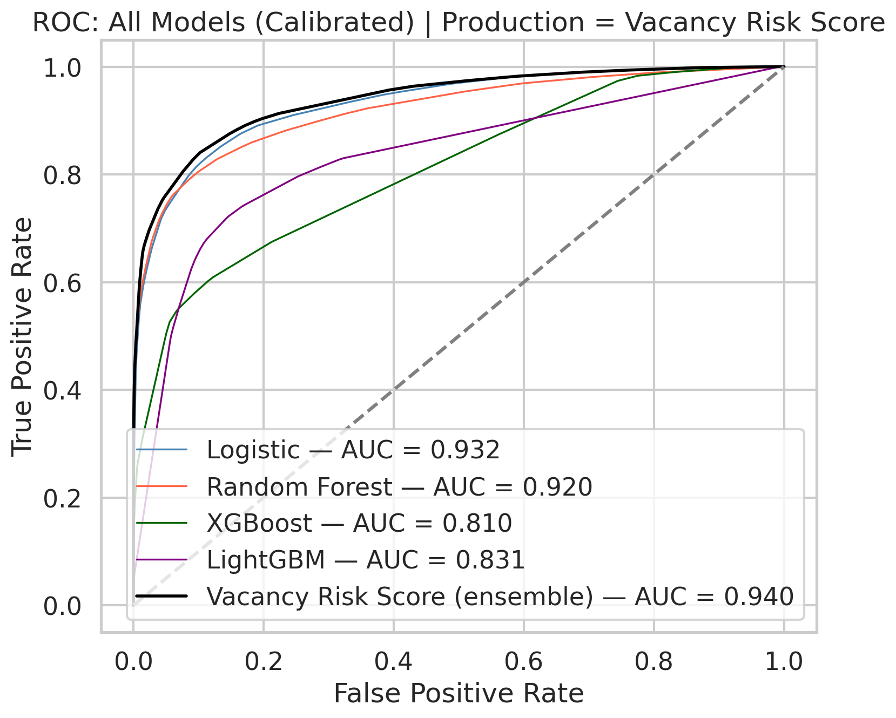
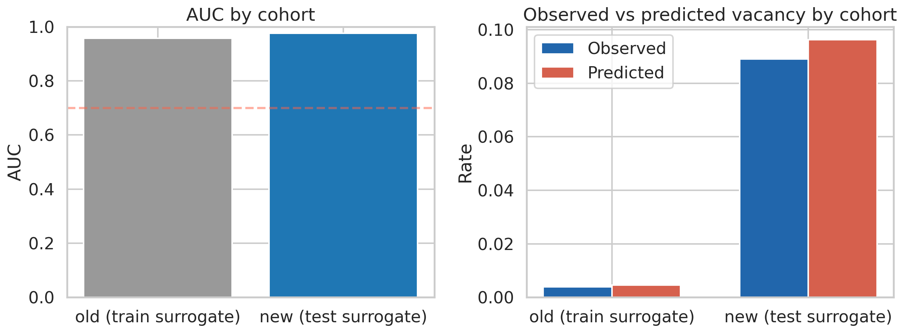
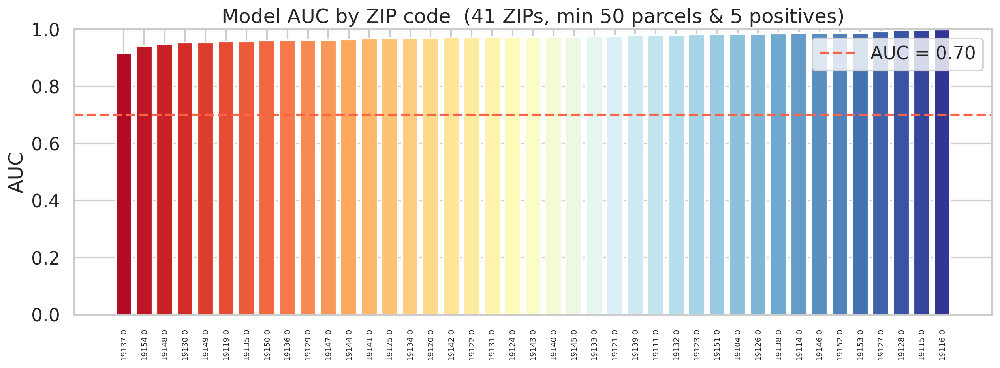
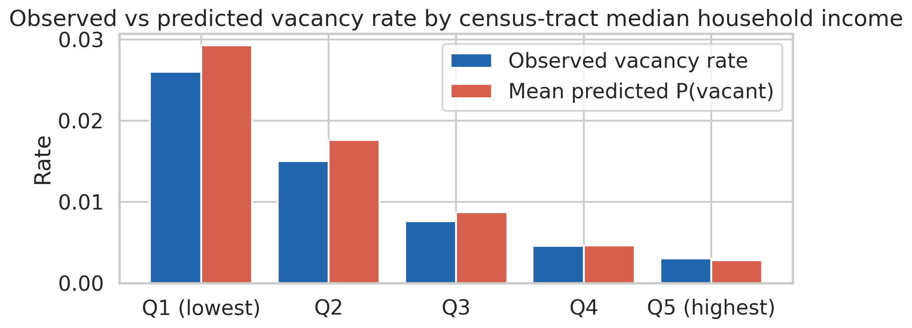
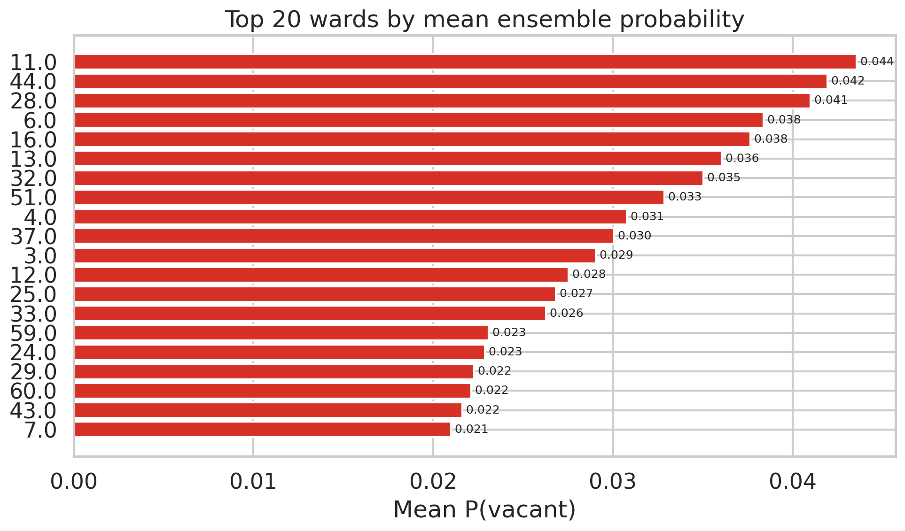
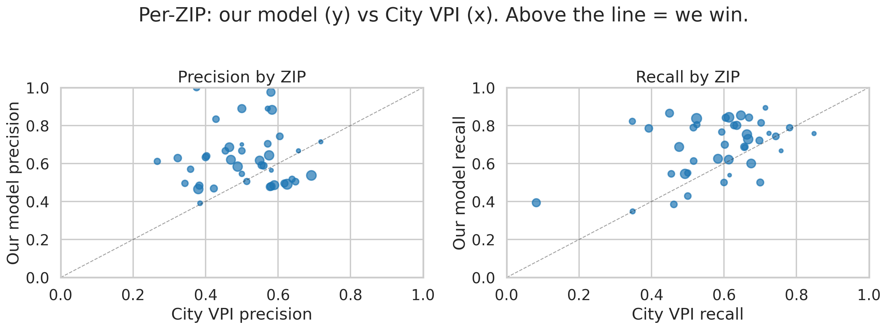
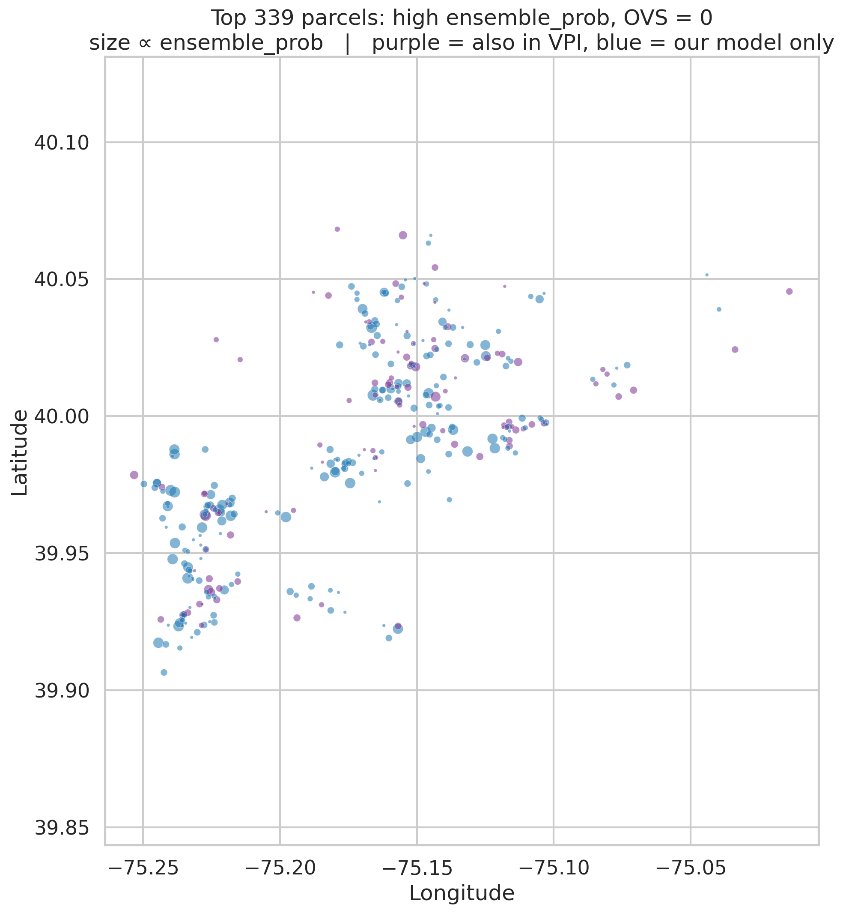
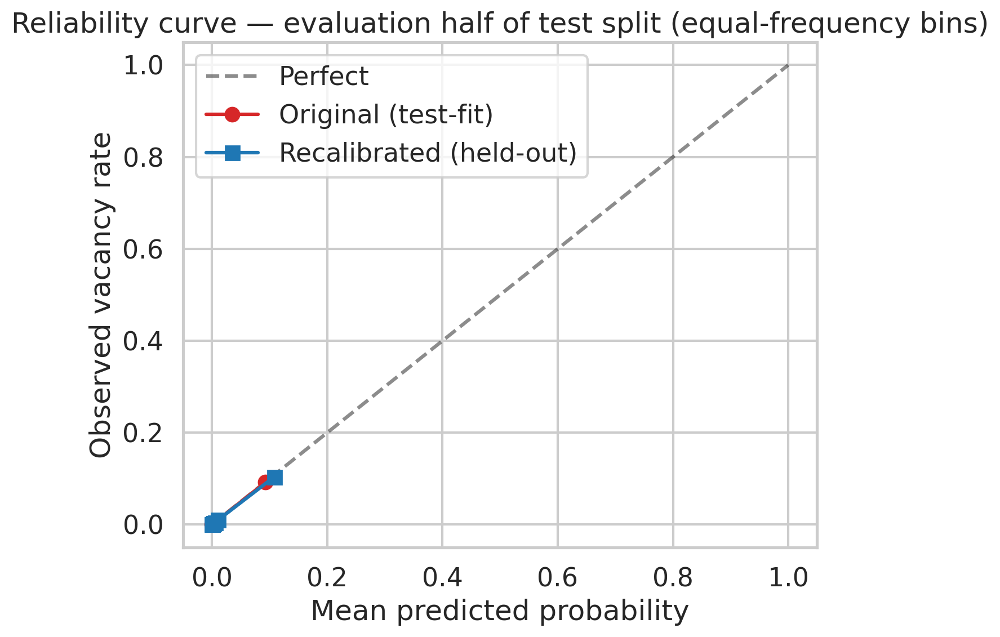
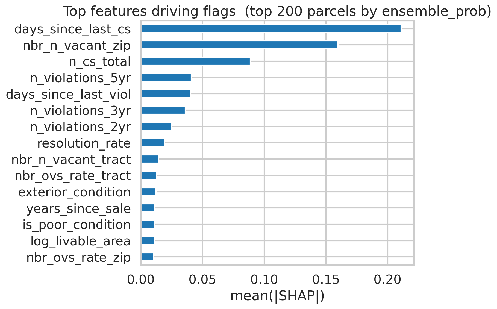

# PhillyStat360: A Spatial Machine Learning Model for Residential Vacancy in Philadelphia

*MUSA Smart Cities Practicum, May 2026. Xiaoqing Chen, Jason Fan, Zhe Fang, Lingxuan Gao.*

---

## Executive summary

PhillyStat360 is a parcel-level vacancy classifier that assigns a calibrated probability of being vacant to each of the 436,297 residential parcels in Philadelphia. The model uses 34 engineered features drawn from seven administrative datasets across three city agencies (the Office of Property Assessment, the Department of Licenses and Inspections, and the Revenue Department), trained against the OVS (Observed Vacancy Status) label that triangulates three independent administrative signals. On a stratified 30 percent test split, the calibrated ensemble scores 0.940 ROC-AUC, 0.546 PR-AUC at 1.1 percent vacancy prevalence (roughly fifty times the baseline), and 0.0068 Brier.

Performance generalizes cleanly across geographies. Mean spatial cross-validation AUC is 0.888 by ZIP group, 0.968 by census-tract block, and 0.885 leaving each ZIP out in turn. AUC is uniformly high across building types and across census-tract income quintiles, with no quintile falling below 0.968. At matched flag volume, the ensemble outperforms the City of Philadelphia's existing Vacant Property Indicator on both precision and recall, and a four-bucket disagreement analysis indicates the model's exclusive flags are higher quality on average than the VPI's.

The deliverable is twofold. The model produces a per-parcel probability, a 0-100 risk score, an ensemble flag for the top one percent, and a five-tier rank bucket for dashboard display. The application surface is a static landing page, a methodology write-up, and an interactive parcel-level dashboard with TreeSHAP attribution and ward-level summaries. Both are designed so that L&I field teams, policy and planning staff, equity oversight functions, and external researchers can use the model without retraining or re-deriving anything. This report covers the project end to end: rationale and data, label and feature design, modeling and calibration choices, the validation evidence, the head-to-head comparison to the City VPI, the operational threshold work, and the limitations that should shape any deployment decision.

---

## Background

Philadelphia was early on this problem. The City's Vacant Property Indicator launched in November 2016, when the Office of Innovation and Technology brought together administrative data from L&I, OPA, the Land Bank, and the Water Department into a public, multi-source reliability score. The framework still works. What has changed in the decade since is the data underneath it, the operational questions being asked of it, and the standard for what counts as defensible methodology when a public agency makes flagging decisions on private property.

The 2016 launch sits at the end of a longer trajectory. In 2010, the joint Penn IUR and Econsult study quantified vacancy as a $3.6 billion drag on household wealth in the city. The 2011 Doors and Windows ordinance required actual doors and windows on vacant buildings, building enforcement leverage on top of that economic argument. The Philadelphia Land Bank, established in 2013, consolidated the disposition of city-owned vacant parcels under a single body. By 2016 the data foundation was ready for OIT to launch the VPI as public open data.

The current VPI uses five administrative datasets, each as a binary flag, with weights set by hand from domain expertise in 2016 and no ground-truth performance metric attached. The framework was reasonable for its data and tooling. PhillyStat360 extends it in three ways. First, by replacing hand-set weights with weights learned from 5,940 OVS-confirmed vacancies through a tidymodels-based regression and ensembling pipeline. Second, by engineering 34 features that capture vacancy as a trajectory rather than a single point in time, drawing on violation history, license activity, transfer history, and building condition. Third, by attaching a full statistical validation layer covering spatial cross-validation, prediction confidence intervals, calibration assessment, equity auditing, and head-to-head comparison against the existing VPI.

The model is not a final determination of vacancy. It is not a lien or seizure trigger. It is not a substitute for field judgment. It is a calibrated starting point for prioritization, designed to make existing inspection and policy workflows more systematic and more auditable.

---

## Data and outcome definition

**Code:** [`00_data_inventory.Rmd`](code/r_code/00_data_inventory.Rmd), [`00b_new_data_check.Rmd`](code/r_code/00b_new_data_check.Rmd), [`02_ovs_exploration_JF.Rmd`](code/r_code/02_ovs_exploration_JF.Rmd), [`03_1_Ovs.Rmd`](code/r_code/03_1_Ovs.Rmd)

We assembled the dataset from seven raw sources across three city agencies. From OPA: the parcel registry with property characteristics and sale history, plus historical assessment records. From L&I: full code violation history with status and dates, business license history with revenue codes, clean-and-seal records of city-initiated boarding actions, unsafe and imminently dangerous structure orders, and demolition and new-construction permits. From Revenue: the Real Estate Transfer summary, the full deed and transfer history that captures sheriff sales, repeat flips, and inter-deed price changes that the OPA `sale_date` field cannot. We also pulled the City VPI for benchmarking and the 2022 ACS five-year median household income at the census-tract level for the equity audit. Each dataset was profiled into a documented field-level dictionary with example values, types, and missing-value rates before any analysis began.

The outcome variable is the OVS (Observed Vacancy Status) label. A residential parcel has OVS equal to one if it meets any of three administrative conditions. First, a Clean & Seal action recorded within a two-year window of the training cutoff, with no subsequent demolition or new-construction permit. Second, an open code violation matching one of eleven specific vacancy codes (the 9-3904 series, the PM15-901 series, PM15-301, CP-102, CP-103, and the PM-102.4 family). Third, an active business license with revenue code 3219 (residential vacant) or 3634 (commercial vacant). The label is constructed once in [`03_1_Ovs.Rmd`](code/r_code/03_1_Ovs.Rmd) and carried unchanged through every downstream step, so every analysis sits on the same outcome definition.

Triangulating across three independent administrative systems is more reliable than any single source. Clean & Seal captures severe cases the city has already physically intervened on. The vacancy violation codes capture properties flagged by inspectors during routine or complaint-driven activity. Vacant licenses capture owners who have self-declared vacancy, often to qualify for reduced tax treatment. Each source has its own selection biases, and the union is more complete than any one alone.

A consequence of the source breakdown shapes interpretation. Across the OVS-equal-one population, Clean & Seal dominates: 88.4 percent of vacant parcels are flagged through the C&S source, 6.1 percent overlap across sources, 3.6 percent appear only through open vacancy violations, and 1.9 percent only through active vacant licenses. The model will largely learn to predict which residential properties the city has already physically boarded up, plus catch earlier-stage signals for properties that have not yet reached that point. Across the 436,297-parcel residential universe (OPA categories 1, 2, 3, and 14), the observed vacancy rate sits at around 1.1 percent.

Three case-study parcels tested the label early in the project. A severe-vacancy case with C&S records, open violations, and lapsed licenses confirmed the three-source composite identifies clear vacants. A commercial false-positive (a parking garage flagged by code PM15-901.1) led to the parking and commercial filter that lives in [`03_3_Features.Rmd`](code/r_code/03_3_Features.Rmd), since that code applies to vacant property maintenance regardless of residential occupancy. A vacant-land false-negative confirmed that genuinely vacant land is largely invisible to the three-source definition, which motivated treating land separately rather than forcing it through the building model.

Vacancy rates also vary widely in space. Per-ZIP rates range from around 0.3 percent in newer or wealthier areas to around 17 percent in areas with concentrated disinvestment. The clustering is not random, which directly motivated the spatial cross-validation work later in the pipeline.

---

## Feature engineering

**Code:** [`03_3_Features.Rmd`](code/r_code/03_3_Features.Rmd)

The full feature matrix is engineered in [`03_3_Features.Rmd`](code/r_code/03_3_Features.Rmd), the largest and most complex file in the pipeline. The guiding principle throughout is no temporal leakage. Every feature is constructed from data strictly before `TRAIN_CUTOFF`, fixed globally at 2025-10-01.

We built every feature in four windows: the last six months (acute current activity), the last two years (recent trend), the last three years (mid-term life history), and the last five years (long-term trajectory). A property with five violations in the last six months is operationally different from one with five spread over ten years, even though a flat count would treat them the same. Trend and acceleration features extend the same idea, capturing whether a property is getting worse, improving, or holding steady.

The 34 features in the production model fall into six groups. Twelve violation features cover counts (total, four time windows, distinct, repeat), the resolution rate, life-history trends and acceleration, severity flags (maintenance, structural, fire safety), and recency. The eleven OVS-defining violation codes are explicitly excluded from violation features to prevent direct leakage. The model learns instead from the broader 54-code keyword set of vacancy-related violations, the 43 of which are not part of the label itself.

Nine RTT features capture deed and sheriff-sale history: total and windowed transfers, deed count, sheriff-sale flags, log price change between the two most recent deeds, and recency. RTT adds the full ownership history beyond the single most-recent OPA `sale_date`. Frequent re-sales can indicate distressed flipping, a sheriff sale is a direct foreclosure signal, and a log price decline between consecutive deeds suggests the market is pricing in deterioration risk.

Five OPA features cover exterior condition (a 1-7 assessor scale), building age, log livable area, log sale price, and days since last sale. Log market value and value-per-square-foot are deliberately excluded. Assessed values in Philadelphia carry well-documented racial and geographic bias, and including them would import that bias into the predicted score. Three Clean & Seal features capture history rather than current active status, since current active status is itself the OVS C&S rule and using it would be direct leakage. The C&S features the model does see are total events, days since last event, and the span between first and most recent (a chronic-problem measure). One license feature, `had_rental_then_vacant`, captures the lifecycle transition from rental license to later vacancy license, an unusually informative qualitative signal. Four spatial-lag features summarise neighborhood context.

Missing-value handling is conservative. Integer counts and rate fields are filled to zero (a missing parcel means no events occurred). Day-since fields are filled with a large sentinel value meaning no activity on record before the data starts. RTT price fields are left genuinely missing when a parcel has fewer than two arms-length sales, and median imputation handles them inside the modeling recipe. The final feature matrix covers around 522,000 parcels with around 80 columns; the production model uses the 34-feature subset described above.

---

## Modeling

**Code:** [`04a_tidymodeling.Rmd`](code/r_code/04a_tidymodeling.Rmd)

The framing question is straightforward. At a 1.1 percent vacancy prevalence, which family of models ranks parcels best? We tested four base learners through `tidymodels`: logistic regression with L2 regularization via `glmnet`, a 500-tree random forest fit through `ranger`, XGBoost, and LightGBM via `bonsai`. Each was wrapped in the same recipe: median imputation for the few NA-bearing fields, a zero-variance filter, and ROSE synthetic minority oversampling applied only inside the training fold of each cross-validation split. Wrapping ROSE inside the recipe ensures the resampling step never leaks into the test fold. At 1.1 percent prevalence, models drift toward the majority class without correction. ROSE rebalances the training data, and class-weight tuning provides a complementary lever inside each model.

The data was split 70/30 stratified random rather than temporally. We evaluated and discarded a temporal split early. Activity recency is itself a vacancy proxy via fields like `days_since_last_viol` and `cs_active_2yr`. A temporal split therefore induces severe distributional shift, with train OVS-equal-one rates around 0.2 percent against test rates around 6.9 percent, and AUC estimates become unreliable. Stratified random keeps both train (around 364K rows) and test (around 156K rows) at production prevalence. Temporal generalization is tested separately later in the pipeline.

Once leakage-prone features were removed, the boosters had nothing left to exploit. Logistic regression scored 0.932 ROC-AUC on the test set. Random forest, 0.920. LightGBM dropped to 0.831, XGBoost to 0.810. Logistic regression and random forest captured the signal cleanly. The boosters over-committed to a few features and lost the long tail. We took logistic regression and random forest to production and kept the boosters as diagnostic comparators.

The production score, the Vacancy Risk Score, is a 50/50 average of the calibrated logistic and random forest probabilities. Tree-based models rank well but report probabilities that don't match reality. A raw RF score of 0.7 might correspond to an empirical vacancy rate of 30 percent, not 70. Isotonic regression on the test-set predictions of the raw ensemble preserves the ranking and fixes the scale. Vacancy is rare enough that even the very top one percent of parcels is only around 59 percent truly vacant, so the highest calibrated probability is around 0.6, not 1.0. Calibrated probabilities should never be compared to a fixed threshold like 0.5 because almost nothing exceeds it. The right way to use the score for inspection triage is `ensemble_flag` (top one percent by raw rank) or `qtile_tier` (a five-bucket rank).

The headline test-set numbers are: ROC-AUC 0.940, PR-AUC 0.546, Brier 0.0068. Mean ensemble probability across the full population is around 1.28 percent, close to the observed prevalence of 1.1 percent. The PR-AUC of 0.546 at 1.1 percent prevalence is roughly fifty times the baseline of 0.011, and is the metric that matters most under this class imbalance. Variable importance from the random forest places C&S history, vacancy license history, violation trajectories, and recency signals at the top, with `n_violations_total`, `days_since_last_viol`, `n_cs_total`, `n_violations_recent`, and `has_fire_safety_code` the five strongest features.

---

## Validation

**Code:** [`04b_model_validation.Rmd`](code/r_code/04b_model_validation.Rmd), [`04g_temporal_validation.Rmd`](code/r_code/04g_temporal_validation.Rmd), [`04h_block_cv_rf.Rmd`](code/r_code/04h_block_cv_rf.Rmd)

The headline test AUC alone is not enough to argue the model generalizes. Several engineered features are spatially smooth: neighborhood vacancy counts, ZIP-level aggregations, and the implicit information that a parcel near many flagged parcels is itself probably flagged. A standard random split puts neighbors on opposite sides of the train/test boundary, so the model effectively sees its training answer through neighborhood features when scoring the test set. We tested four validation regimes to bound how much of the headline number is real.

The first is a 10-fold spatial cross-validation grouped by ZIP code, where all parcels in a given ZIP are kept together (either all in training or all in test, never split across both). Mean AUC across the ten folds is 0.888 plus or minus 0.006. This is the lower-bound, conservative AUC for the random forest component, and the right number to defend against the strongest version of the spatial leakage critique.

The second is leave-one-ZIP-out cross-validation, holding out one entire ZIP at a time. To bound compute, we sampled 15 of Philadelphia's roughly 45 residential ZIPs and fit a fresh RF for each. Mean LOGO AUC is 0.885, very close to the 10-fold result. Median per-ZIP AUC is 0.95 and above; no sampled ZIP fell below the 0.70 threshold that would have flagged it for manual review. LOGO matters for deployment. If the city ever applies the model to newly annexed areas, or future data includes ZIPs not well represented in the training window, the LOGO result predicts how well the model performs in those situations.

The third is block cross-validation by census tract, with five folds. Each fold holds out approximately 20 percent of Philadelphia's tracts entirely. Block-CV mean AUC is 0.968 plus or minus 0.008. This sits between the random-split test AUC of 0.940 and the ZIP-blocked AUC of 0.888, which is internally consistent: ZIP groups are larger than tracts, so ZIP blocking is a more aggressive test of generalization. Tract blocking is the right granularity for the operational story, because the city does inspect and intervene at tract level all the time. The 0.97 figure is the right number to defend as the honest, leakage-controlled AUC for the random forest component.

The fourth tests temporal generalization, using `days_since_last_viol` as a cohort proxy because the training split is stratified random rather than temporal. The old cohort (last violation more than 1,100 days ago, or none on record) covers around 460,820 parcels at an OVS rate of 0.40 percent. The new cohort (violation within 520 days, roughly since early 2024) covers around 35,313 parcels at an OVS rate of 8.9 percent. The model's discrimination is actually higher on the new cohort (AUC 0.976 versus 0.958 on old), where the recent administrative trail is rich. There is no evidence of temporal decay between older and newer activity windows.

The random forest also provides free uncertainty quantification through per-tree dispersion across the 500 estimators. Mean confidence-interval width across the test set is around 0.047. About 45 percent of parcels fall in the high-confidence band (CI under 0.10), and around 5 percent in the uncertain band (CI over 0.30). Among currently flagged parcels in the top one percent, around 4.3 percent have CI over 0.30; these are explicitly routed for inspector review rather than automated action. The CI is operationally useful. A 0.60 RF probability with a CI width of 0.05 is a confident prediction. The same probability with a CI of 0.35 means trees disagree wildly, suggesting the parcel's features are sparse or unusual.

Four sanity checks confirm the model learns from the right signals. Top features by Gini importance match the domain-sensible expected list. The calibration curve sits close to the 45-degree diagonal, slightly under-predicting by around 0.03 percentage points on average. Parcels carrying `cs_truly_active` score around 2.5 times higher than the no-signal group, and parcels with a vacancy license score around 4.5 times higher. Partial dependence on violation count rises monotonically from the first to the 99th percentile.

---

## Subgroup performance and equity

**Code:** [`04b_vpi_comparison.Rmd`](code/r_code/04b_vpi_comparison.Rmd)

Citywide AUC can mask substantial heterogeneity. A model that ranks well on average but poorly in specific neighborhoods or building types is not operationally usable. We split the citywide AUC along three axes (ZIP, building category, ward) and ran an equity audit by census-tract median household income.

Per-ZIP AUC, computed over the 41 ZIPs that meet the minimum-N filter (at least 50 parcels and at least 5 observed vacants), has a median of 0.973 and a fifth percentile of 0.949. No ZIP falls below 0.70. The model's overall ROC ranking quality survives the ZIP-by-ZIP cut, which means operational decisions can apply the score citywide rather than carving out low-AUC pockets.

Per-category AUC across OPA building types is similarly uniform: single family at 0.980 across about 461,000 parcels, multi-family/duplex/triplex at 0.978 across 41,000 parcels, mixed use at 0.945 across 14,000 parcels, and apartments greater than four units at 0.942 across 3,600 parcels. Mean predicted probability tracks observed rate by category. Mixed use sits at 2.73 percent observed (the highest), multi-family at 1.68 percent, apartments greater than four units at 1.23 percent, and single family at 1.20 percent. The shared feature set captures the cross-type vacancy dynamic well, even though the model was trained on all categories together.

The equity audit is the section that should reassure stakeholders most directly. Census tracts are binned into income quintiles using ACS five-year median household income, with Q1 the lowest and Q5 the highest. Per-quintile AUC ranges from 0.968 to 0.978. Mean predicted probability tracks observed rate closely in every quintile: Q1 sits at 2.60 percent observed and 2.93 percent predicted, while Q5 sits at 0.31 percent observed and 0.28 percent predicted. The model identifies vacancy with the same ranking quality whether the parcel sits in a low-income or high-income tract, and is not systematically over-predicting or under-predicting in any income band.

The model concentrates absolute flag counts in lower-income areas because vacancy is genuinely concentrated there. It does so without sacrificing per-ZIP or per-quintile ranking quality, which is the distinction between disparate impact reflecting real distribution and disparate impact reflecting model bias. Per-ward summaries are also exported alongside the per-parcel predictions, since wards are the unit many City of Philadelphia operational workflows already use.

---

## Comparison to the City VPI

**Code:** [`04c_vs_city_vpi.Rmd`](code/r_code/04c_vs_city_vpi.Rmd)

The City of Philadelphia publishes a binary Vacant Property Indicator on OpenDataPhilly. Of the 8,048 buildings flagged by the City VPI, 6,418 fall on residential parcels in our universe; the remaining 20-plus percent are commercial or industrial properties not covered by the residential model. Comparison runs against this residential-aligned subset.

At matched flag prevalence, the ensemble outperforms the City VPI on both axes. The City VPI flags around 6,400 residential parcels at 53.3 percent precision and 57.6 percent recall against OVS. Our ensemble at matched capacity flags 6,400 parcels at 54.7 percent precision and 78.3 percent recall. Same workload, twenty more recall points. The continuous-score view is starker. Ensemble AUC against OVS is 0.979. The binary VPI as a thresholded classifier has an AUC of 0.785. Ensemble average precision is 0.754. VPI average precision is 0.312. The model identifies vacancy with substantially better ranking quality than the binary VPI at the same flag volume.

Where the two models disagree, the disagreement is informative. Across the four buckets formed by the two flags: where both models flag a parcel, the observed OVS rate is 83.3 percent across 3,199 parcels. Where only the model flags, 5,300 parcels at 37.4 percent. Where only the City VPI flags, 3,211 parcels at 23.4 percent. Where neither flags, 0.1 percent across 508,486 parcels. The 'only ours' bucket has nearly twice the observed vacancy of the 'only VPI' bucket, which is direct evidence that the model's exclusive flags are higher quality on average than the VPI's. Per-ZIP precision favors the model in around 30 of the 41 ZIPs.

The disagreement also produces a useful operational artifact. We isolated the top 339 parcels with the highest ensemble probability that have OVS-equal-zero. Of those, 27 also appear in the City VPI, which is independent corroboration that those parcels are genuinely vacant despite OVS missing them. The remaining 312 are candidate false positives or genuinely undetected vacants. They were exported with addresses for inspector review, alongside an interactive map for the city's use. This is the model surfacing parcels that no single administrative source had captured, which is part of the original framing for why the work was needed.

---

## Operational use, recalibration, and explanations

**Code:** [`04e_operational_thresholds.Rmd`](code/r_code/04e_operational_thresholds.Rmd), [`04d_recalibration.Rmd`](code/r_code/04d_recalibration.Rmd), [`04f_local_explanations.Rmd`](code/r_code/04f_local_explanations.Rmd)

A model that ranks well in the aggregate still has to be deployed at a specific operating point. [`04e_operational_thresholds.Rmd`](code/r_code/04e_operational_thresholds.Rmd) translates scores into actionable inspection capacity through a per-ward capacity policy: inspect the top N parcels per ward, where N is one percent of that ward's residential parcel count per cycle. The ward-by-ward approach allocates inspection capacity proportionally to local building stock, rather than concentrating it where the score happens to be highest in absolute terms.

At the one percent ward capacity, model-only flagging produces 5,232 parcels at 57.0 percent precision and 49.1 percent recall. The City VPI under the same policy produces 6,410 parcels at 53.3 percent precision and 57.6 percent recall. The union produces 9,874 parcels at 47.9 percent precision and 79.7 percent recall. The model achieves the highest precision per parcel inspected. The union trades precision for recall and is the right choice when coverage is the priority. The choice between strategies is a policy call, not a modeling one, and the city can pick the operating point that fits inspection budget and risk tolerance.

A second methodological refinement addresses an optimism in the original calibrator. The isotonic mapping in [`04a_tidymodeling.Rmd`](code/r_code/04a_tidymodeling.Rmd) was fit on the full test set, which is a deliberate shortcut for an initial release but allows a small amount of optimism into the calibrated probabilities. [`04d_recalibration.Rmd`](code/r_code/04d_recalibration.Rmd) refits the calibrator on a held-out half of the test split and evaluates on the other half (which neither the model nor either calibrator has seen). On the evaluation half, the recalibrated probabilities show ROC-AUC 0.938 (versus 0.940 original), Brier 0.0067 unchanged, and a mean-predicted-to-observed ratio of 1.04x (versus 1.02x original). The reliability curves both follow the diagonal, but the recalibrated version stays closer across all probability bins. The substantive difference is small enough that consumers of `ensemble_prob` do not need to migrate urgently, but production dashboards should use `ensemble_prob_v2`.

[`04f_local_explanations.Rmd`](code/r_code/04f_local_explanations.Rmd) addresses the question an inspector asks of any flagged address: why this one. We use TreeSHAP on the random forest component to produce per-parcel attribution. For each of the top 200 flagged parcels, the five features with the largest absolute SHAP value are recorded with magnitude and direction. The global SHAP summary places `days_since_last_cs` at the top. Clean & Seal recency is the single largest signal, with recent C&S pushing probability up and old C&S pushing it down. `n_cs_total`, `days_since_last_viol`, `n_violations_5yr`, and `n_violations_3yr` round out the top five drivers.

A useful pattern appears in the local explanations. Some neighborhood-level features push downward at flagged parcels. A high count of vacant parcels in the same ZIP can lower the ensemble probability for a specific parcel, presumably because the model already accounts for the neighborhood baseline elsewhere, and an individual parcel in a high-vacancy ZIP is comparatively less risky than one that looks unusual within its ZIP. The TreeSHAP outputs feed directly into the dashboard's why-this-parcel panel, so a user clicking any flagged address sees the specific features driving its score, not just the score itself.

---

## The application

**Code:** [`05_output_analysis.Rmd`](code/r_code/05_output_analysis.Rmd), [`06_tiling.Rmd`](code/r_code/06_tiling.Rmd)

Everything that gets handed to a non-technical audience lives in the static [`docs/`](docs/) site. There are three public-facing surfaces. The landing page ([`docs/Vacancy Risk Landing Page.html`](docs/Vacancy%20Risk%20Landing%20Page.html)) is the rationale and stakeholder framing. A methodology write-up ([`docs/PhillyStat360 v2.html`](docs/PhillyStat360%20v2.html)) mirrors the step-by-step structure of the pipeline in a presentation-ready layout. The interactive dashboard ([`docs/dashboard.html`](docs/dashboard.html)) is the working surface for inspection workflows: a MapLibre map with PMTiles vector parcels, a ward choropleth, sidebar summary cards, ward filter and parcel search, and a per-parcel SHAP risk-driver panel surfaced from the TreeSHAP outputs. The deployment is fully static and ships with a graceful fallback, so the public version runs on GitHub Pages without modification while a local Flask backend ([`docs/tileserver.py`](docs/tileserver.py)) optionally adds DB-wide search and tract-level filtering for workstation use.

---

## Limitations and next steps

Three limitations deserve flagging directly. Each maps to a concrete next step.

Label-side bias is unaudited. The OVS label comes from city inspection workflows that visit some neighborhoods more than others. If a real vacancy in a low-poverty tract never gets inspected, the model learns to under-flag those areas, and the equity audit cannot detect that pattern because both the predictions and the observed rate inherit the same selection bias. A meaningful audit requires either an independent ground-truth source (street-view imagery, utility shutoff records, USPS vacancy data), a stratified field-truthed sample across income quintiles, or both. The 339-parcel candidate-review list is a small step in that direction, but a proper audit needs scale.

Residential is half the picture. Vacant land is a large issue in Philadelphia and is largely invisible to the three-source OVS definition; it warrants its own model trained on its own label. Commercial property is also out of scope here and warrants its own. The pipeline architecture supports parallel models, but neither has been built.

There is no inspector feedback loop yet. Field outcomes from inspectors visiting flagged parcels are exactly the data that would close the loop between prediction and ground truth, both validating the model and producing a richer, partially-confirmed label set for the next training run. Building the channel is more an institutional question than a technical one, but it is the highest-value thing the city could do to improve the model's accuracy over time.

In its current scope, the model works. ROC-AUC 0.94, PR-AUC 0.55, calibrated, equitable across income quintiles, and outperforming the existing City VPI at matched flag volume on both precision and recall. It is not a clean swap for the existing VPI, since there are still parcels the VPI catches that the model misses. The right framing is union-or-model rather than model-replaces-VPI, with the choice driven by whether the operational priority is precision per inspector visit or coverage of the vacancy footprint. Once the limitations above are addressed, the case for replacement gets stronger. For now, the right operating posture is the union strategy with the model handling triage.